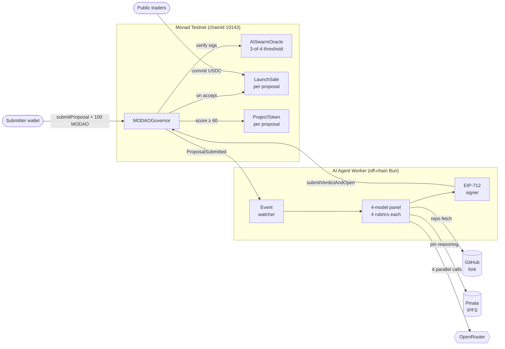

<div align="center">


# MODAO

**MetaDAO's fundraise mechanism, on EVM, with an AI swarm replacing the human curator.**

[](https://testnet.monadscan.com)
[](https://soliditylang.org)
[](https://book.getfoundry.sh)
[](https://nextjs.org)
[](https://typescriptlang.org)
[](https://viem.sh)
[](https://openrouter.ai)
[](https://pinata.cloud)
[](https://bun.sh)

</div>

---

## ▶ See it run

**Think hackathon peer voting — but every judge is a different AI model.** Four LLMs from Anthropic, OpenAI, and Google independently score each forked submission across the same four rubrics (origin lineage, novelty, technical merit, demo readiness). The cross-checked mean per rubric is what gets threshold-signed and posted on-chain.

The same brain evaluates **every** fork of `monad-developers/monad-blitz-kl` — no per-project setup, no hardcoded list. As new submissions land, the worker watches `ProposalSubmitted` on-chain and scores whatever GitHub URL the submitter pinned.

Run it locally against any fork:

```bash
cd agents
bun run dry <github-url>
```

To see the brain across the current hackathon cohort, the table below picks three real submissions at different quality levels. Same prompt, same rubrics — the panel discriminates honestly:

| Submission | origin | novelty | tech | demo | **aggregate** | verdict |
|---|---:|---:|---:|---:|---:|---|
| [`mhrk04/crank-foodie`](https://github.com/mhrk04/crank-foodie) — restaurant hygiene on-chain | 91 | 79 | 67 | 63 | **75** | ✅ accept (≥60) |
| [`wwaiyyee/memetaverse`](https://github.com/wwaiyyee/memetaverse) — `create-next-app` boilerplate, no contracts | 15 | 5 | 0 | 2 | **6** | ❌ reject |
| [`chiwjieren/hiveguard`](https://github.com/chiwjieren/hiveguard) — README + screenshots only | 15 | 0 | 5 | 0 | **5** | ❌ reject |

Sample output for the accepted one (wall-clock 41s, 4-model OpenRouter call + Pinata pinning + EIP-712 signing):

```
⏱  START  2026-05-16T08:16:48.836Z
▸ panel: claude-haiku, claude-sonnet, gpt-4.1, gemini-2.5-flash
▸ target: https://github.com/mhrk04/crank-foodie

[dry] fork check: PASS — parent=monad-developers/monad-blitz-kl  (762ms)

  [gpt-4.1         ] openai/gpt-4.1                      avg=89  (origin=97 novelty=92 tech=86 demo=82)   7.9s
  [gemini-2.5-flash] google/gemini-2.5-flash             avg=81  (origin=95 novelty=85 tech=70 demo=75)   8.8s
  [claude-haiku    ] anthropic/claude-haiku-4.5          avg=56  (origin=78 novelty=62 tech=45 demo=38)  15.4s
  [claude-sonnet   ] anthropic/claude-sonnet-4.5         avg=73  (origin=92 novelty=78 tech=65 demo=58)  38.8s

Per-rubric (mean across panel, failed members = 0):
  origin   ██████████████████··  91/100
  novelty  ████████████████····  79/100
  tech     █████████████·······  67/100
  demo     █████████████·······  63/100

Aggregate:  75/100   (above on-chain minScore=60 → admission-worthy ✅)
4 IPFS pins · 4 EIP-712 sigs · ready for submitVerdictAndOpen
```

Each agent's reasoning is content-addressed on IPFS — paste the CID into [gateway.pinata.cloud](https://gateway.pinata.cloud) to read what each model wrote.

---

## Architecture



**The brain (Option B cross-rubric)**: every model evaluates every rubric in one structured-output call. Per-rubric score = mean across 4 models. A single hallucination is dampened by the other three reads.

---

## Tech stack

| Layer | Package | Tech | Why |
|---|---|---|---|
| Contracts | `contracts/` | Solidity 0.8.24 · Foundry · OpenZeppelin · via_ir | Test-driven; full lifecycle covered by Foundry suite |
| AI brain | `agents/` | TypeScript · Bun · viem · OpenAI SDK → OpenRouter · zod · Pinata | One key, four labs (Anthropic, OpenAI, Google) for heterogeneity |
| Frontend | `web/` | Next.js 15 · React 19 · Wagmi v2 · RainbowKit · Tailwind v4 · Shadcn | Sub-second feel via `useSendTransactionSync` |
| Shared | `packages/shared/` | TypeScript · viem types · ABI re-exports | Single source of truth (`deployments/monad-testnet.json`) |
| Indexer | — | HyperIndex (Envio) | Deferred — currently RPC-scan from frontend |

---

## Quick start

Monorepo uses **Bun workspaces**. First-time setup:

```bash
bun install
```

### Contracts

```bash
cd contracts
forge build
forge test
```

Deploy/redeploy runbook: [`contracts/DEPLOY.md`](./contracts/DEPLOY.md). Latest addresses in [`deployments/monad-testnet.json`](./deployments/monad-testnet.json).

### AI agent worker

```bash
cd agents
cp .env.example .env
# Fill: OPENROUTER_API_KEY, PINATA_JWT, SUBMITTER_PRIVATE_KEY
#       Optional: GITHUB_TOKEN (raises REST limit 60→5000/hr)

bun run dry <github-url>     # dry-run — score a fork, no on-chain submit
bun run worker                # long-lived event watcher (production mode)
bun run once <proposalId>    # one-shot — score + submit for a known proposal
```

Agent signing keys are derived deterministically from a shared seed; they already match the addresses Sean registered in `AISwarmOracle`. **No manual key management.**

### Frontend

```bash
cd web
bun run dev    # http://localhost:3000
```

---

## Repo layout

```
MODAO/
├── contracts/                  Foundry — Solidity 0.8.24, via_ir, optimizer 200 runs
│   ├── src/                    MODAOGovernor, AISwarmOracle, LaunchSale, ProjectToken,
│   │                           ConditionalVault, ProposalAMM, MODAOToken, MockUSDC
│   ├── test/                   Foundry unit + end-to-end (13/13 green on v3)
│   └── script/                 Deploy.s.sol, RedeployGovernor.s.sol
│
├── agents/                     Off-chain AI swarm — TypeScript + Bun
│   └── src/
│       ├── personas/
│       │   ├── panel.ts         4 model declarations (paid + free fallbacks)
│       │   ├── rubric.ts        shared 4-rubric system prompt + zod schema
│       │   ├── _callModel.ts    OpenRouter call with per-call sentinel nonce
│       │   └── _prompt.ts       proposal → markdown w/ untrusted-README wrap
│       ├── github.ts            REST client + buildRepoBundle
│       ├── forkCheck.ts         lineage check vs monad-developers/monad-blitz-kl
│       ├── ipfs.ts              Pinata pinning (per-agent reasoning)
│       ├── prepare.ts           enrichContext + SSRF-guarded URL extraction
│       ├── orchestrate.ts       scoreProposal pure + runVerdict live
│       ├── runDryEval.ts        CLI dry-run with timing report
│       ├── worker.ts            event watcher
│       └── chain.ts             lazy wallet (dry-run needs no submitter key)
│
├── web/                        Next.js 15 — landing + create + proposals + dao
│   └── src/
│       ├── app/                 routes: /, /create, /proposals, /proposals/[id], /dao
│       └── components/          brand, landing, layout, proposals, ui
│
├── packages/shared/            Cross-package types, ABIs, deployment addresses
├── deployments/                On-chain deployment artifacts
│   └── monad-testnet.json      canonical address book — single source of truth
│
├── PLAN.md                     architecture decisions + roadmap
├── PITCH.md                    4-slide hackathon deck
└── COMPETITORS.md              competitor landscape
```

---

<div align="center">

**Built for [Monad Blitz Kuala Lumpur](https://blitz.devnads.com)**

Fork of [`monad-developers/monad-blitz-kl`](https://github.com/monad-developers/monad-blitz-kl)

</div>
